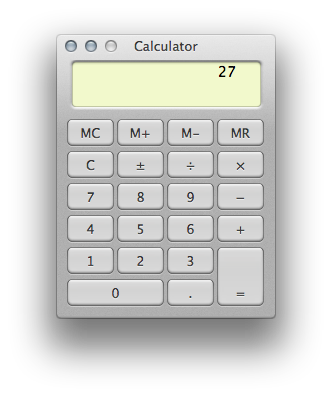

# Calculator

A macOS-style calculator widget built with plain HTML, CSS, and vanilla JavaScript — no frameworks or dependencies.



## Features

- Full arithmetic: addition, subtraction, multiplication, division
- Operator chaining (e.g. `5 + 3 *` evaluates `8` before continuing)
- Sign toggle (`±`), decimal input, and division-by-zero handling
- Memory functions: `MC`, `M+`, `M-`, `MR`
- Floating-point noise suppression (e.g. `0.1 + 0.2` displays `0.3`)
- Draggable — grab the title bar and drag the calculator anywhere on the page

## How it's built

- **`index.html`** — markup for the calculator UI
- **`css/base.css`** — base page styles
- **`css/osx.css`** — macOS-inspired visual styling (gradients, border-radius, box-shadows)
- **`js/calc.js`** — all calculator logic and drag behaviour in a single vanilla JS IIFE; no libraries required

## Running locally

No build step needed. Open `index.html` directly in any modern browser:

```
open index.html
```

## Project

https://github.com/paragshah/Calculator
